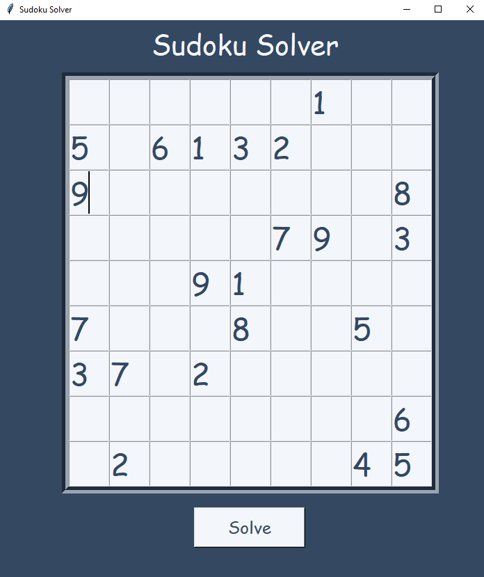
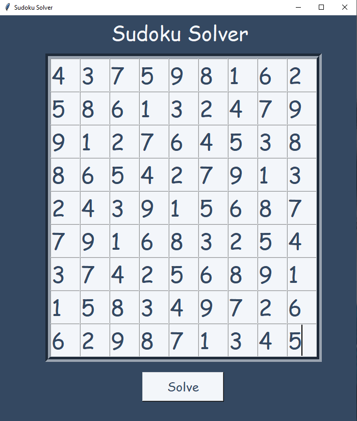

*****Sudoku Solver*****

This is a sudoku solver program which demostrates the consept of recursion and backtracking. Backtracking approach is used when all possible solutions are to be found out with a given contrain. A good sudoku puzzle has unique solution. The problem is solved by checking the numbers 1 to 9 recursively with contrains. Backtraking is executed when we determine that our current solution cannot be continued in a complete one. 

